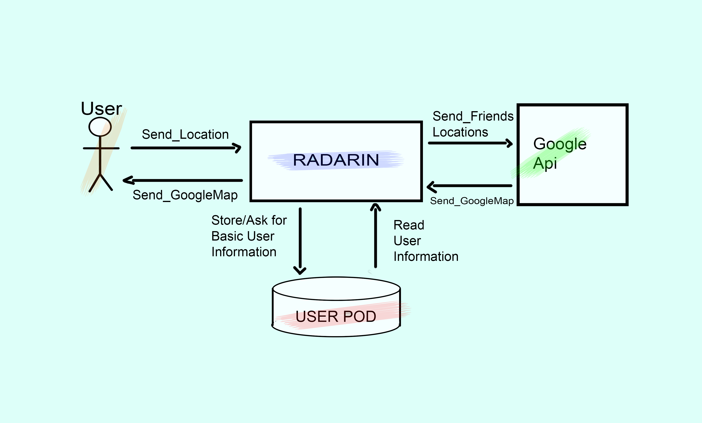
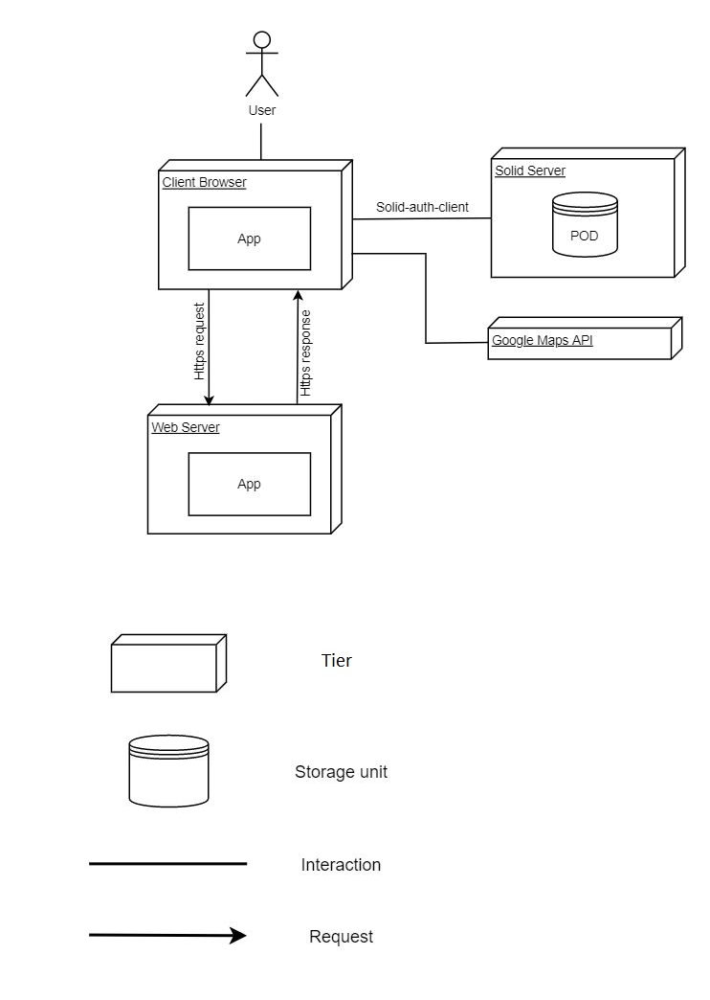

[[section-system-scope-and-context]]

== System Scope and Context

.Contents
Radarin is an application that will allow users to find nearby friends, one feature that we want to remark is that stores the minimun required user data in base of the SOLID principles, the rest of the information will be requested to the user via user POD.

[role="arc42help"]

=== Business Context

[role="arc42help"]

**<Diagram or Table>**

[options="header",cols="1,2"]
|===
|Stakeholder|Motivation
| _User_ | _Any user should be able to send his location and receive the location of the nearby friends_ 
| _Server Web Radarin_ | _Processes the information given by the users, consults the user POD and retrieves the information from the google API_ 
| _POD_ | _The data of any usser should be properly protected with a Solid Server with POD_ 
| _Google API_ | _The application should be able to communicate with the google maps API_ 
|===

**<optionally: Explanation of external domain interfaces>**

=== Technical Context

_This is a temporal table and has been made by en2a group on 2019-2020 course_

[role="arc42help"]

**<Diagram or Table>**

[options="header",cols="1,2"]
|===
|...|...
| _..._ | _..._ 
| _..._ | _..._ 
| _..._ | _..._ 
|===

**<optionally: Explanation of technical interfaces>**

**<Mapping Input/Output to Channels>**
